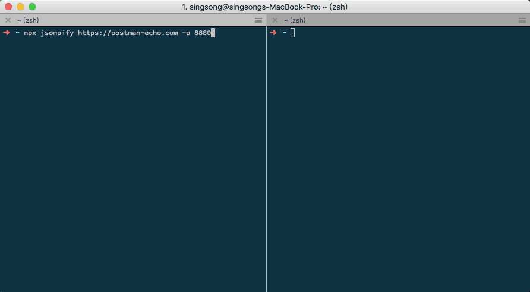

# node-jsonpify

在开发时，为了提高开发效率，使用 [YApi](https://github.com/YMFE/yapi) Mock 系统来辅助开发。但 YAPI 不支持 jsonp。而 node-jsonpify 就为此而诞生的。



## Install

```
npm install jsonpify -g
```
如果不想安装可以直接使用 `npx`（推荐）
```js
npx jsonpify http://example.com
```

## Usage

```js
// 默认( 端口：3232，callback 参数及值：callback=callback)
jsonpify http://example.com
```

- 指定端口

  ```js
  jsonpify http://example.com  -p 8080
  jsonpify http://example.com  --port 8080
  ```

  > 如果指定的端口占用，jsonpify 会提供备选端口

- 指定 callback 参数名，来获取包裹 json 数据的函数名

  ```js
  // http://api.example.com?cb=fun
  jsonpify http://example.com  -n cb
  jsonpify http://example.com  --name cb

  // 返回结果
  // fun({json data})
  ```

- 如果接口不支持 `callback=？` 参数，可以使用`-w`选项来指定包裹 json 数据的函数名

  ```js
  // http://api.example.com
  jsonpify http://example.com  -w fun
  jsonpify http://example.com  --wrapper fun

  // 返回结果
  // fun({json data})
  ```

- 更多帮助

  ```js
  jsonpify -h
  jsonpify --help
  ```

## Dome

- 接口：[https://postman-echo.com/get](https://postman-echo.com/get)

- 使用 jsonpify
  ```js
  npx jsonpify https://postman-echo.com -p 8880
  ```
- 访问：[http://localhost:8880/get?callback=jsonpify](http://localhost:8880/get?callback=jsonpify)
