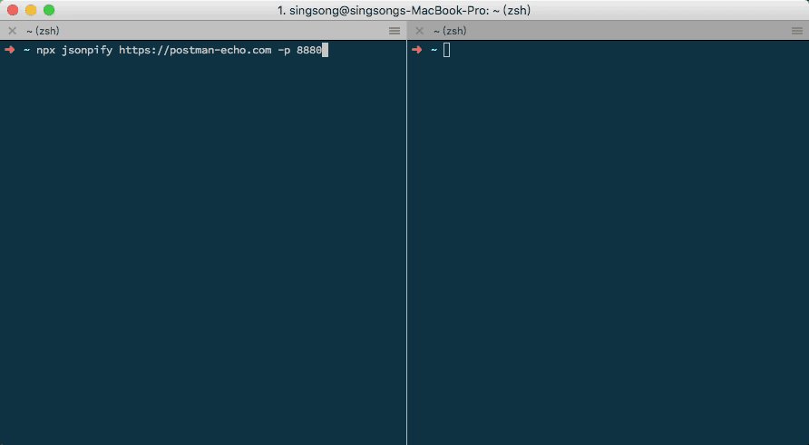

# node-jsonpify

自从组内部署了 [YApi](https://github.com/YMFE/yapi) Mock 系统后，做项目时都会使用它来辅助开发。但在最近的项目中，有对 jsonp 接口的需求。尴尬的是 YApi 不支持  jsonp。为了能快速地完成工作，就封装了一个将普通接口转为 jsonp 形式的命令行小工具：[jsonpify](https://github.com/zhansingsong/node-jsonpify)。

虽然代码很简单(95 sloc)，但该有的基本功能已具备：端口检查、日志输出、友好提示等。

## 效果



## 安装

```
npm install jsonpify -g
```
如果不想安装可以直接使用 `npx`（推荐）
```js
npx jsonpify http://example.com
```

## 使用

```js
// 默认( 端口：3232，callback 参数及值：callback=callback)
jsonpify http://example.com
```

- 指定端口

  ```js
  jsonpify http://example.com  -p 8080
  jsonpify http://example.com  --port 8080
  ```

  > 如果指定的端口已被占用，jsonpify 会提供备选端口

  

- 指定 callback 参数名，来获取包裹 json 数据的函数名

  ```js
  // http://api.example.com?cb=fun
  jsonpify http://example.com  -n cb
  jsonpify http://example.com  --name cb

  // 返回结果
  // fun({json data})
  ```

- 如果接口不支持 `callback=？` 参数，可以使用`-w`选项来指定包裹 json 数据的函数名

  ```js
  // http://api.example.com
  jsonpify http://example.com  -w fun
  jsonpify http://example.com  --wrapper fun

  // 返回结果
  // fun({json data})
  ```

- 更多帮助

  ```js
  jsonpify -h
  jsonpify --help
  ```

## Dome

1. 接口：[https://postman-echo.com/get](https://postman-echo.com/get)

2. 使用 jsonpify
  ```js
  npx jsonpify https://postman-echo.com -p 8880
  ```
3. 访问：[http://localhost:8880/get?callback=jsonpify](http://localhost:8880/get?callback=jsonpify)

## 总结

本文主要与大家分享自己开发过程中封装的小工具 jsonpify。感兴趣的小伙伴，可以自行体验。这里也感慨一下，node 资源包真的很丰富，为我们快速地产出各种辅助开发工具提供很大的便利。
